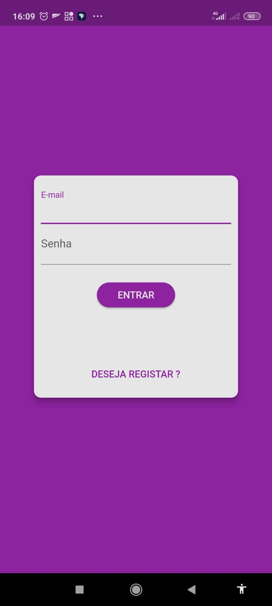
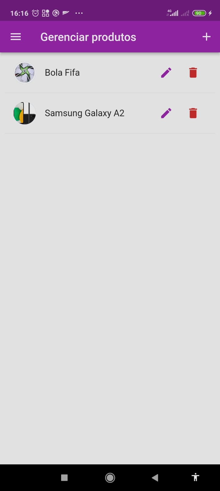
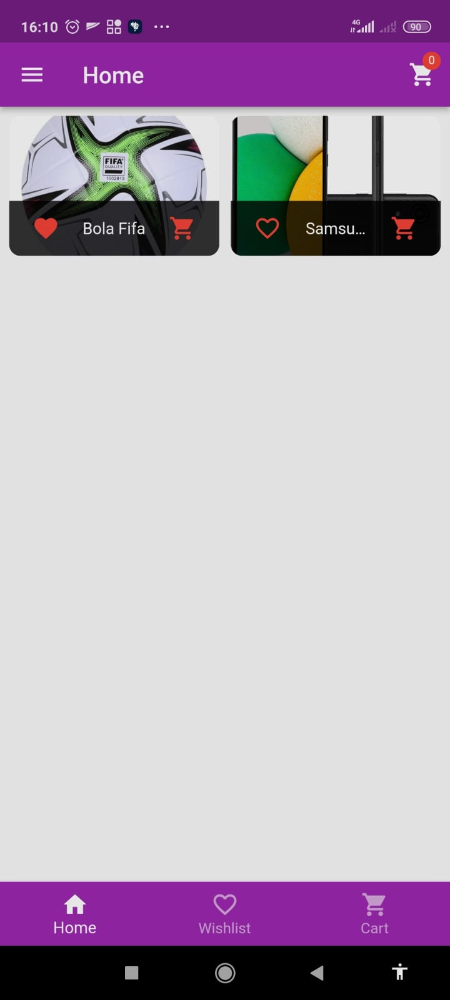
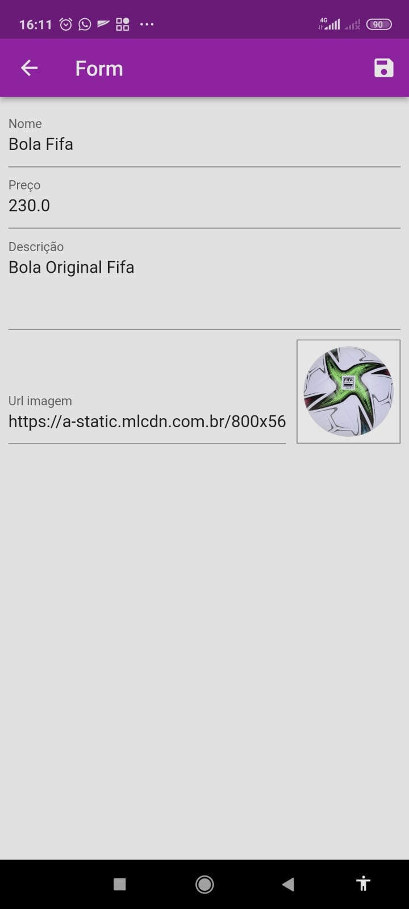
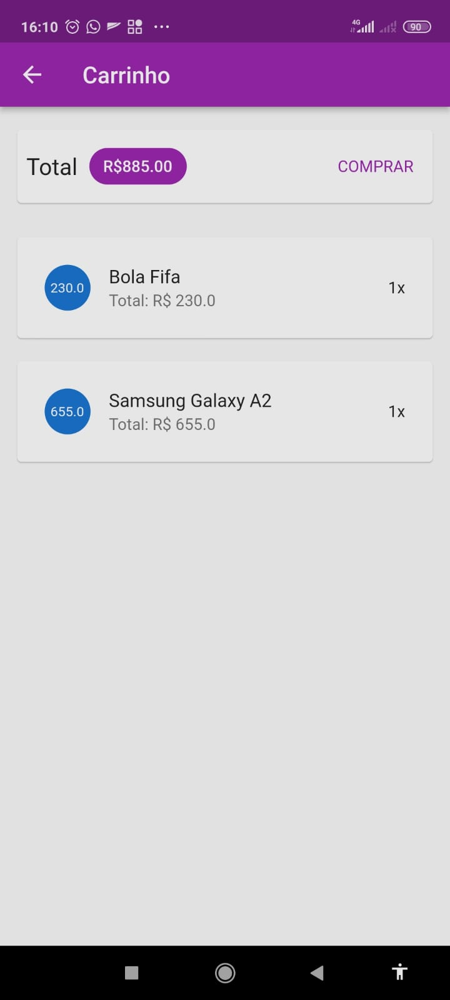
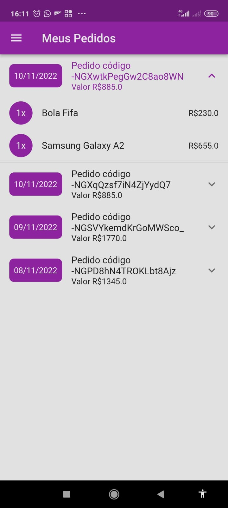

## Basic Flutter App Shop for Study

## Features:

- Product Catalog
- Favorites list
- Shopping cart
- Add and remove products
- Product registration form
- Login and Singup
- auto logout
- List of Orders relized

## Main applied knowledge:

- Future Builder
- Async Wait Function
- Bottom Nagivation Bar
- Drawer
- Provider
- MultiProvider
- ProxyProvider
- Routes Nagivation
- Http <POST, DELETE, GET, PATCH, PUT>
- Json Decode and Encode
- Form 
- Form validation
- FireBase Auth
- Persistent storage - shared_preferences

## Login

  

## Products

  
  
  

## Cart and Orders

  
  

